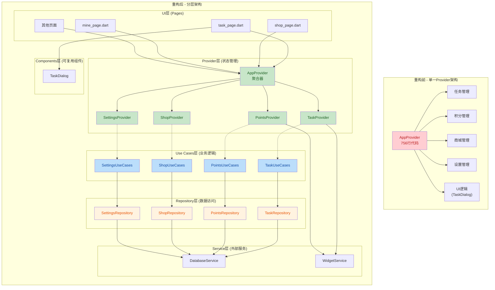
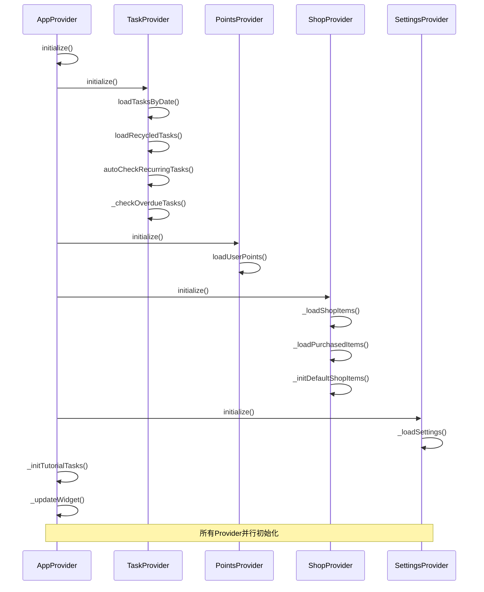

## 1. 高层摘要 (TL;DR)

- **影响:** **高** - 对整个应用的状态管理架构进行了重大重构,将单一的大型Provider拆分为多个专门的Provider,并引入了Repository和Use Cases层
- **核心变更:**
  - ✨ 将 `AppProvider` (756行) 拆分为 4 个专门的Provider: `TaskProvider`、`PointsProvider`、`ShopProvider`、`SettingsProvider`
  - 🏗️ 新增 **Repository 数据访问层** 和 **Use Cases 业务逻辑层**,实现更清晰的架构分层
  - 🧩 提取 `TaskDialog` 组件,将UI代码从 `main.dart` 中分离
  - 📝 新增 `REFACTOR_PLAN.md` 重构计划文档
  - 🔧 更新所有页面以适配新的Provider结构

***

## 2. 可视化概览 (代码与逻辑映射)

### 2.1 架构重构前后对比



### 2.2 Provider 初始化流程



***

## 3. 详细变更分析

### 3.1 新增文件

| 文件                                          | 类型         | 说明                    |
| :------------------------------------------ | :--------- | :-------------------- |
| `REFACTOR_PLAN.md`                          | 文档         | 详细的重构计划书,包含目标、步骤和风险评估 |
| `lib/providers/task_provider.dart`          | Provider   | 任务管理状态,370行           |
| `lib/providers/points_provider.dart`        | Provider   | 积分管理状态,70行            |
| `lib/providers/shop_provider.dart`          | Provider   | 商城管理状态,145行           |
| `lib/providers/settings_provider.dart`      | Provider   | 设置管理状态,86行            |
| `lib/repositories/task_repository.dart`     | Repository | 任务数据访问层,73行           |
| `lib/repositories/points_repository.dart`   | Repository | 积分数据访问层,23行           |
| `lib/repositories/shop_repository.dart`     | Repository | 商城数据访问层,37行           |
| `lib/repositories/settings_repository.dart` | Repository | 设置数据访问层,18行           |
| `lib/use_cases/task_use_cases.dart`         | Use Case   | 任务业务逻辑,102行           |
| `lib/use_cases/points_use_cases.dart`       | Use Case   | 积分业务逻辑,35行            |
| `lib/use_cases/shop_use_cases.dart`         | Use Case   | 商城业务逻辑,136行           |
| `lib/use_cases/settings_use_cases.dart`     | Use Case   | 设置业务逻辑,32行            |
| `lib/components/task_dialog.dart`           | Component  | 任务对话框组件,317行          |

### 3.2 AppProvider 重构 (核心变更)

**源文件:** `lib/providers/app_provider.dart`

**变更说明:**

- **删除:** 所有直接的业务逻辑和数据访问代码 (约600行)
- **新增:** 4个子Provider的实例化和协调逻辑
- **保留:** 页面状态管理 (`_currentTab`) 和小组件同步逻辑

**关键代码变更:**

```dart
// 重构前: 直接管理所有状态
class AppProvider extends ChangeNotifier {
  List<Task> _tasks = [];
  List<ShopItem> _shopItems = [];
  UserPoints _userPoints = UserPoints();
  // ... 大量业务逻辑
}

// 重构后: 聚合器模式
class AppProvider extends ChangeNotifier {
  late final TaskProvider task;
  late final PointsProvider points;
  late final ShopProvider shop;
  late final SettingsProvider settings;
  
  AppProvider() {
    task = TaskProvider();
    points = PointsProvider();
    shop = ShopProvider();
    settings = SettingsProvider();
    
    // 监听子Provider变化并转发
    task.addListener(_onSubProviderChanged);
    points.addListener(_onSubProviderChanged);
    shop.addListener(_onSubProviderChanged);
    settings.addListener(_onSubProviderChanged);
  }
  
  // 便捷访问器
  int get currentPoints => points.currentPoints;
  DateTime get selectedDate => task.selectedDate;
  ThemeMode get themeMode => settings.themeMode;
}
```

### 3.3 TaskProvider (任务管理)

**源文件:** `lib/providers/task_provider.dart`

**职责:**

- 管理任务列表和回收站任务
- 处理任务的增删改查
- 管理循环任务生成逻辑
- 处理任务完成/取消完成
- 管理日期选择和多任务模式

**关键方法:**

| 方法                              | 说明           |
| :------------------------------ | :----------- |
| `initialize()`                  | 初始化任务数据      |
| `loadTasksByDate(DateTime)`     | 加载指定日期的任务    |
| `addTask(Task)`                 | 添加任务(支持循环任务) |
| `updateTask(Task, {updateAll})` | 更新任务         |
| `deleteTask(int, {deleteAll})`  | 删除任务         |
| `completeTask(Task)`            | 完成任务并奖励积分    |
| `uncompleteTask(Task)`          | 取消完成并扣除积分    |
| `restoreTaskFromRecycle(int)`   | 从回收站恢复任务     |
| `_generateTaskRange(Task)`      | 生成循环任务实例     |

### 3.4 PointsProvider (积分管理)

**源文件:** `lib/providers/points_provider.dart`

**职责:**

- 管理用户积分状态
- 处理积分增减
- 与小组件同步积分数据

**关键方法:**

| 方法                       | 说明       |
| :----------------------- | :------- |
| `loadUserPoints()`       | 加载用户积分   |
| `addPoints(int)`         | 添加积分     |
| `deductPoints(int)`      | 扣除积分     |
| `updatePoints(int)`      | 更新积分     |
| `syncPointsFromWidget()` | 从小组件同步积分 |

### 3.5 ShopProvider (商城管理)

**源文件:** `lib/providers/shop_provider.dart`

**职责:**

- 管理商城商品列表
- 管理已购买商品
- 处理商品购买逻辑
- 初始化默认商品

**关键方法:**

| 方法                            | 说明      |
| :---------------------------- | :------ |
| `initialize()`                | 初始化商城数据 |
| `addShopItem(ShopItem)`       | 添加商品    |
| `updateShopItem(ShopItem)`    | 更新商品    |
| `deleteShopItem(int)`         | 删除商品    |
| `purchaseItem(ShopItem, int)` | 购买商品    |
| `deletePurchasedItem(int)`    | 删除已购买商品 |

### 3.6 SettingsProvider (设置管理)

**源文件:** `lib/providers/settings_provider.dart`

**职责:**

- 管理应用主题模式
- 管理任务视图模式
- 管理引导任务完成状态

**关键方法:**

| 方法                              | 说明       |
| :------------------------------ | :------- |
| `toggleTheme()`                 | 切换主题     |
| `setThemeMode(ThemeMode)`       | 设置主题模式   |
| `setTaskViewMode(TaskViewMode)` | 设置任务视图模式 |
| `toggleTaskViewMode()`          | 切换任务视图模式 |
| `markTutorialCompleted()`       | 标记引导完成   |

### 3.7 Repository 层 (数据访问)

**职责:** 封装数据库操作,提供统一的数据访问接口

| Repository           | 主要方法                                                                                           |
| :------------------- | :--------------------------------------------------------------------------------------------- |
| `TaskRepository`     | `getTasksByDate`, `createTask`, `updateTask`, `deleteTask`, `completeTask`, `getRecycledTasks` |
| `PointsRepository`   | `getUserPoints`, `addPoints`, `deductPoints`, `updatePoints`                                   |
| `ShopRepository`     | `getAllShopItems`, `createShopItem`, `getAllPurchasedItems`, `addPurchasedItem`                |
| `SettingsRepository` | `getSettings`, `saveSettings`, `clearAllData`                                                  |

### 3.8 Use Cases 层 (业务逻辑)

**职责:** 封装业务规则,协调多个Repository的操作

| Use Case           | 主要方法                                                                            |
| :----------------- | :------------------------------------------------------------------------------ |
| `TaskUseCases`     | `checkOverdueTasks`, `completeTask`, `uncompleteTask`, `restoreTaskFromRecycle` |
| `PointsUseCases`   | `hasEnoughPoints`                                                               |
| `ShopUseCases`     | `purchaseItem`, `initDefaultShopItems`                                          |
| `SettingsUseCases` | `markTutorialCompleted`                                                         |

### 3.9 TaskDialog 组件提取

**源文件:** `lib/components/task_dialog.dart`

**变更说明:**

- 从 `main.dart` 中提取了约300行的任务对话框代码
- 封装为静态方法 `TaskDialog.showAddOrEditTaskDialog()`
- 支持添加和编辑任务两种模式

**使用方式:**

```dart
// 在 main.dart 中简化为:
void _showAddOrEditTaskDialog(BuildContext context, {Task? task}) {
  TaskDialog.showAddOrEditTaskDialog(context, task: task);
}
```

### 3.10 页面适配变更

所有页面都需要更新以适配新的Provider结构:

| 页面                      | 主要变更                                                                                                         |
| :---------------------- | :----------------------------------------------------------------------------------------------------------- |
| `task_page.dart`        | `provider.tasks` → `provider.task.tasks`, `provider.completeTask()` → `provider.task.completeTask()`         |
| `shop_page.dart`        | `provider.shopItems` → `provider.shop.shopItems`, `provider.purchaseItem()` → `provider.shop.purchaseItem()` |
| `calendar_page.dart`    | `provider.tasks` → `provider.task.tasks`                                                                     |
| `mine_page.dart`        | `provider.isDark` → `provider.settings.isDark`, `provider.isRichView` → `provider.settings.isRichView`       |
| `recycle_bin_page.dart` | `provider.recycledTasks` → `provider.task.recycledTasks`                                                     |
| `statistics_page.dart`  | `provider.tasks` → `provider.task.tasks`                                                                     |
| `warehouse_page.dart`   | `provider.purchasedItems` → `provider.shop.purchasedItems`                                                   |

***

## 4. 影响与风险评估

### 4.1 破坏性变更 ⚠️

| 变更类型                | 影响范围 | 说明                                                  |
| :------------------ | :--- | :-------------------------------------------------- |
| **Provider API 变更** | 所有页面 | 所有访问 `AppProvider` 的代码都需要更新为访问子Provider             |
| **导入路径变更**          | 所有页面 | 需要导入 `settings_provider.dart` 以使用 `TaskViewMode` 枚举 |
| **初始化流程变更**         | 应用启动 | Provider初始化现在是并行的,可能影响启动时间                          |

### 4.2 测试建议 🧪

1. **功能测试:**
   - ✅ 测试任务的增删改查功能
   - ✅ 测试循环任务的生成和更新
   - ✅ 测试积分的增减和同步
   - ✅ 测试商城商品的购买和使用
   - ✅ 测试主题切换和任务视图切换
2. **边界测试:**
   - ✅ 测试空列表状态下的UI显示
   - ✅ 测试积分不足时的商品购买
   - ✅ 测试回收站的恢复和删除
3. **集成测试:**
   - ✅ 测试小组件数据同步
   - ✅ 测试跨Provider的数据一致性(如任务完成时积分更新)
4. **性能测试:**
   - ✅ 对比重构前后的应用启动时间
   - ✅ 测试大量任务列表的渲染性能

### 4.3 潜在风险 🔍

| 风险                | 概率 | 影响 | 缓解措施                                |
| :---------------- | :- | :- | :---------------------------------- |
| **Provider监听器泄漏** | 中  | 高  | 已在 `AppProvider.dispose()` 中移除所有监听器 |
| **数据同步不一致**       | 中  | 中  | 使用统一的Repository和Use Cases层确保一致性     |
| **启动性能下降**        | 低  | 低  | 使用 `Future.wait()` 并行初始化各Provider   |
| **UI状态更新延迟**      | 低  | 中  | 子Provider变化会触发AppProvider通知         |

***

## 5. 重构收益

### 5.1 代码质量提升

| 指标               | 重构前  | 重构后  | 改善     |
| :--------------- | :--- | :--- | :----- |
| AppProvider 代码行数 | 756行 | 247行 | ⬇️ 67% |
| 单一职责原则           | ❌ 违反 | ✅ 遵循 | ✅      |
| 代码可测试性           | 低    | 高    | ✅      |
| 模块化程度            | 低    | 高    | ✅      |

### 5.2 架构优势

- **清晰的分层:** UI → Provider → Use Cases → Repository → Service
- **高内聚低耦合:** 每个Provider只负责一个领域的状态管理
- **易于扩展:** 新增功能只需添加对应的Provider、Repository和Use Cases
- **便于测试:** 可以独立测试每一层
- **代码复用:** Repository和Use Cases可以在不同场景下复用

### 5.3 维护性提升

- **问题定位:** 问题可以快速定位到具体的Provider或Repository
- **并行开发:** 不同开发者可以同时修改不同的Provider
- **文档完善:** 新增了详细的重构计划文档

***

## 6. 后续建议

1. **添加单元测试:** 为每个Repository和Use Cases添加单元测试
2. **添加集成测试:** 测试Provider之间的交互
3. **性能优化:** 监控应用启动时间和内存使用
4. **错误处理:** 在Use Cases层添加更完善的错误处理机制
5. **日志系统:** 添加统一的日志系统便于调试

***

## 总结

本次重构是一次**成功的架构升级**,将一个臃肿的单体Provider拆分为多个职责单一的Provider,并引入了Repository和Use Cases层,实现了清晰的分层架构。虽然需要更新所有页面的代码,但带来的代码质量、可维护性和可测试性的提升是显著的。重构遵循了SOLID原则,为未来的功能扩展和维护打下了坚实的基础。
